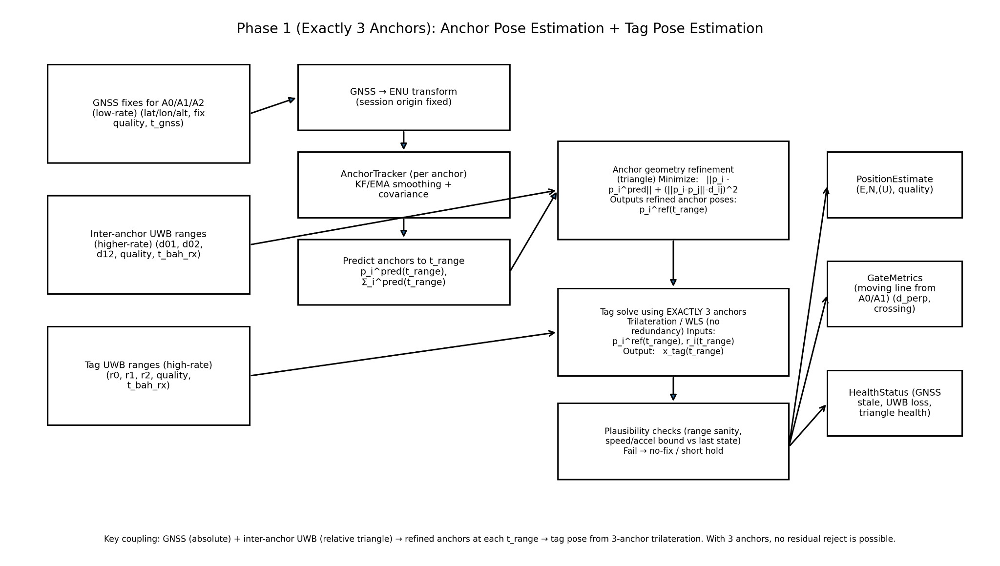

# HKSI Windsurf E-Gate POC

UWB-based positioning system for windsurf start-line monitoring on water.

**Target Platform:** Ubuntu on Raspberry Pi (ARM64)  
**Status:** Phase 1 - 90% Complete

---

## System Overview

3-anchor UWB + GNSS positioning system with start-line crossing detection.



### Data Flow

```
┌─────────────────────────────────────────────────────────────────────────────┐
│                    PHASE 1: 3-ANCHOR ESTIMATION FLOW                        │
└─────────────────────────────────────────────────────────────────────────────┘

INPUTS                          PROCESSING                         OUTPUTS
──────                          ──────────                         ───────

┌──────────────────┐
│ GNSS Fixes       │     ┌──────────────────┐
│ (A0, A1, A2)     │────▶│ GNSS → ENU       │
│ lat/lon/alt      │     │ Transform        │
│ 1 Hz             │     └────────┬─────────┘
└──────────────────┘              │
                                  ▼
                         ┌──────────────────┐
                         │ AnchorTracker    │
                         │ (per anchor)     │
                         │ 6D Kalman Filter │
                         └────────┬─────────┘
                                  │
                                  ▼
┌──────────────────┐     ┌──────────────────┐
│ Inter-Anchor UWB │────▶│ Anchor Geometry  │
│ Ranges           │     │ Refinement       │     ┌──────────────────┐
│ d01, d02, d12    │     │ WLS Optimization │────▶│ PositionEstimate │
│ 10 Hz            │     └────────┬─────────┘     │ (E, N, U)        │
└──────────────────┘              │               │ quality score    │
                                  ▼               └──────────────────┘
                         ┌──────────────────┐
                         │ Predict Anchors  │
                         │ to t_range       │
                         │ p_i, Σ_i         │
                         └────────┬─────────┘
                                  │
┌──────────────────┐              │
│ Tag UWB Ranges   │              ▼
│ (high-rate)      │     ┌──────────────────┐     ┌──────────────────┐
│ r0, r1, r2       │────▶│ Tag Solve        │────▶│ GateMetrics      │
│ 10 Hz            │     │ Trilateration    │     │ d_perp, crossing │
└──────────────────┘     │ 3 anchors        │     └──────────────────┘
                         └────────┬─────────┘
                                  │
                                  ▼
                         ┌──────────────────┐     ┌──────────────────┐
                         │ Plausibility     │────▶│ HealthStatus     │
                         │ Checks           │     │ GNSS stale       │
                         │ speed/accel      │     │ UWB loss         │
                         │ innovation       │     │ triangle health  │
                         └──────────────────┘     └──────────────────┘

Key: GNSS (absolute) + Inter-anchor UWB (relative) → refined anchors
     → tag pose from 3-anchor trilateration
```

---

## Features

- **3-anchor positioning**: UWB trilateration with GNSS anchor tracking
- **Cross-platform**: Windows (development), Linux ARM64 (deployment)
- **Robust estimation**: Range gating, plausibility checks, kinematic filtering
- **Gate metrics**: Moving start-line crossing detection with confidence
- **Field-hardened**: Tolerates packet loss, out-of-order data, anchor drift

---

## Quick Start (Raspberry Pi)

### 1. Install Dependencies

```bash
sudo apt-get update
sudo apt-get install python3-pip git gcc python3-numpy

git clone <repo-url>
cd hksi-windsurf-e-gate-poc
pip3 install -r requirements.txt
```

### 2. Build Native Library

```bash
./scripts/build_trilateration.sh arm64
```

### 3. Verify Platform

```bash
python3 scripts/verify_platform.py
```

### 4. Run System

```bash
python3 main.py --host 0.0.0.0 --port 8765
```

---

## Architecture

```
bah_core/
├── localization/           # Positioning algorithms
│   ├── anchor_tracker.py       # P1-A: 6D Kalman filter
│   ├── anchor_network_fusion.py # P1-B: WLS geometry refinement
│   ├── tag_solver.py           # P1-C: 2D/3D multilateration
│   ├── tag_range_gating.py     # P1-D: Outlier rejection
│   ├── tag_kinematic_filter.py # P1-D: Smoothing + holdover
│   ├── plausibility_checker.py # P1-D: Motion validation
│   └── robust_tag_positioning.py # P1-D: Unified pipeline
├── domain/
│   └── gate_calculator.py      # P1-E: Crossing detection
├── proto/                  # Message schemas
│   ├── inter_anchor_range.py
│   ├── tag_range.py
│   ├── position_estimate.py
│   └── gate_metrics.py
└── metrics/                # Diagnostics
    └── counters.py
```

---

## Phase 1 Status

| Milestone | Description | Status |
|-----------|-------------|--------|
| **P0** | RPi/Ubuntu compatibility | Complete |
| **P1-A** | Anchor GNSS tracking (Kalman) | Complete |
| **P1-B** | Inter-anchor UWB fusion (WLS) | Complete |
| **P1-C** | Tag multilateration (2D/3D) | Complete |
| **P1-D** | Robustness (gating, filtering) | Complete |
| **P1-E** | Gate metrics (crossing detection) | Complete |
| **P1-F** | BAH → Server uplink | Pending |

**Progress:** 90% complete (4,715 lines, 101 tests passing)

---

## Performance

| Stage | Latency |
|-------|---------|
| Anchor tracking | 0.10 ms |
| Inter-anchor fusion | 0.21 ms |
| Tag multilateration | 0.05 ms |
| Plausibility + filter | 0.04 ms |
| Gate metrics | < 0.01 ms |
| **Total** | **0.41 ms** |

**Margin:** 244x for 10Hz operation

---

## Usage Example

```python
from bah_core.localization import (
    AnchorTracker,
    AnchorNetworkFusion,
    create_default_pipeline,
)
from bah_core.domain import create_default_gate_calculator

# Setup
trackers = {"A0": AnchorTracker("A0"), "A1": AnchorTracker("A1"), "A2": AnchorTracker("A2")}
fusion = AnchorNetworkFusion()
tag_pipeline = create_default_pipeline("T1")
gate_calc = create_default_gate_calculator("A0", "A1")

# Processing loop
for gnss, inter_ranges, tag_ranges in data_stream:
    # Update anchors
    for aid, pos in gnss.items():
        trackers[aid].update_gnss(t_now, pos, quality)
    
    gnss_states = {aid: t.predict(t_now) for aid, t in trackers.items()}
    
    # Refine anchor geometry
    fusion_result = fusion.fuse(gnss_states, inter_ranges, t_now)
    
    # Solve tag position
    estimate = tag_pipeline.process(tag_ranges, fusion_result.refined_anchors, t_now)
    
    # Compute gate metrics
    gate = gate_calc.compute_metrics(estimate, fusion_result.refined_anchors)
    
    if gate.has_crossing:
        print(f"CROSSING: {gate.crossing_event.name}")
```

---

## Testing

```bash
pytest tests/ -v                          # All tests
pytest tests/test_inter_anchor_fusion.py  # P1-B
pytest tests/test_tag_solver.py           # P1-C
pytest tests/test_robust_positioning.py   # P1-D
pytest tests/test_gate_metrics.py         # P1-E
```

---

## Documentation

| Document | Description |
|----------|-------------|
| [Design Doc](docs/design_doc.md) | System architecture |
| [Dev Plan](docs/dev_plan.md) | Milestones and criteria |
| [Phase 0 Report](docs/PHASE0_REPORT.md) | RPi/Ubuntu support |
| [Phase 1 Report](docs/PHASE1_REPORT.md) | Positioning system |
| [Status](docs/COMPREHENSIVE_STATUS.md) | Current progress |

---

## Deployment (systemd)

```bash
sudo cp services/bah.service /etc/systemd/system/
sudo systemctl enable bah.service
sudo systemctl start bah.service
sudo journalctl -u bah.service -f
```

---

## License

Copyright 2024. All rights reserved.

See [Design Document](docs/design_doc.md) for Decawave Ltd. copyright on trilateration code.
